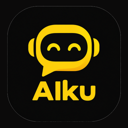

<p align="center">
  
</p>

# Aiku

Aplikasi chat AI mobile untuk Android & iOS. Client ringan berbasis **Expo + React Native**
yang menyambung ke endpoint apa pun yang **OpenAI-compatible** — 9Router self-hosted,
OpenRouter, atau server LLM milikmu sendiri.

Bawa kunci API sendiri (BYOK): base URL dan API key diisi dari dalam aplikasi, disimpan
terenkripsi di perangkat, dan tidak pernah di-hardcode di source code.

---

## Fitur

- **Streaming real-time** lewat SSE, dengan buffer + throttle agar UI tidak re-render per token.
- **Indikator status satu sumber kebenaran** — satu state machine per satu balasan asisten:
  `idle → submitted → reasoning | tool_running | streaming → idle`. Semua indikator muncul
  hanya selama proses berjalan dan hilang otomatis saat selesai, gagal, atau dibatalkan.
- **Reasoning** — menampilkan jejak berpikir model (dilipat satu baris secara default, bisa dibuka).
- **Tool calling** dengan tool lokal `search_history` (mencari di riwayat chat di perangkat),
  lengkap dengan agentic loop dan batas iterasi.
- **Markdown** pada balasan asisten (heading, list, blockquote, code block).
- **Riwayat offline** di SQLite: sesi, pesan, nama project, dan pencarian.
- **Projects** — mengelompokkan percakapan ke dalam folder, dengan penghitung sesi.
- **Pemilih model** yang membaca `GET /v1/models` dan mendeteksi capability
  (`tools`, `reasoning`) dari `supported_parameters`.
- **Stop di tengah streaming** — teks parsial tetap disimpan, bukan dibuang.
- **Keyboard yang benar** — composer tidak pernah tertutup keyboard.
- **Hemat dependensi** — tidak ada library ikon sama sekali; seluruh glyph digambar
  manual dari primitif `View`.

## Tangkapan layar

<!-- TODO: tambahkan screenshot asli di sini -->
Referensi desain: [`aiku-chat-preview.html`](./aiku-chat-preview.html) (mockup HTML yang
bisa dibuka langsung di browser).

## Tech stack

| Layer | Pilihan |
|---|---|
| Framework | Expo SDK 57 (managed workflow) + React Native 0.86 |
| Bahasa | TypeScript (strict) |
| Navigasi | expo-router (file-based) |
| State | React hooks — tanpa state library eksternal |
| Animasi | `Animated` bawaan React Native (tanpa `reanimated`) |
| Networking | `expo/fetch` + parser SSE sendiri |
| Riwayat | `expo-sqlite` |
| Kredensial | `expo-secure-store` |
| Markdown | `react-native-markdown-display` |

## Struktur project

```
app/                      # rute expo-router
├─ _layout.tsx            # root layout, tema navigasi, splash animasi
└─ (tabs)/
   ├─ index.tsx           # layar chat
   ├─ history.tsx         # riwayat percakapan
   └─ settings.tsx        # konfigurasi endpoint & model
components/
├─ chat/status/           # komponen indikator proses AI
├─ DesignSystem/          # token & glyph (digambar manual, tanpa library ikon)
└─ Sidebar/               # drawer, projects, modal
hooks/                    # useChat, useAiRun, useModels, useSessionLibrary, ...
services/                 # network, SQLite, secure-store, parser SSE, tool lokal
types/                    # tipe domain & design token
```

## Menjalankan

Prasyarat: Node.js dan app **Expo Go** di HP.

```bash
npm install

npx expo start        # lalu scan QR dengan Expo Go
```

Perintah lain:

```bash
npm run typecheck     # tsc --noEmit
npm run lint          # expo lint
```

> Jalankan `typecheck` dan `lint` sebelum menganggap perubahan selesai.

## Konfigurasi (BYOK)

Buka tab **Pengaturan**, isi:

1. **Base URL** — contoh `http://<ip-vps>:20128` untuk 9Router, atau
   `https://openrouter.ai/api` untuk OpenRouter.
2. **API Key** — token Bearer untuk endpoint tersebut.
3. **Model default** — bisa diketik manual atau dipilih dari hasil **Uji Koneksi**.
4. **System prompt** (opsional).

Kalau base URL atau API key belum diisi, aplikasi otomatis mengarahkan ke Pengaturan saat dibuka.

## Model & capability

Daftar model diambil dari `GET {BASE_URL}/v1/models`. Capability diturunkan dari field
`supported_parameters` dan objek `reasoning` pada data model:

- `tools` didukung → parameter `tools` ikut dikirim di setiap request.
- `reasoning` didukung → parameter `reasoning: { enabled: true }` ikut dikirim.

Kalau endpoint tidak mengembalikan `supported_parameters`, keduanya dianggap **tidak
didukung** dan tidak dikirim — aman, tapi indikator tool dan reasoning tidak akan muncul.
Pada model yang mengeluarkan reasoning secara default, teksnya tetap tertangkap parser
walau parameter tidak dikirim.

## Penyimpanan data

| Data | Tempat | Catatan |
|---|---|---|
| Base URL, API key, model, system prompt | `expo-secure-store` | terenkripsi, hanya di perangkat |
| Sesi, pesan, project | SQLite (`ai-chat.db`) | offline-first |
| Reasoning & langkah tool | memori saja | transient, hilang saat run selesai |

Skema SQLite dimigrasi otomatis saat aplikasi dibuka: kolom baru ditambahkan hanya bila
belum ada, sehingga database dari versi sebelumnya tetap kompatibel tanpa kehilangan data.

## Build & install ke HP

Build APK memakai EAS Build (cloud), tanpa perlu Android Studio:

```bash
npm install -g eas-cli     # sekali saja
eas login
eas build -p android --profile preview
```

Profil `preview` menghasilkan **APK** (`distribution: internal`, `buildType: apk`) yang bisa
langsung di-install. Profil `production` menghasilkan **AAB** untuk Play Store.

Ikon launcher dan splash native hanya muncul di build seperti ini — **Expo Go tidak pernah
menampilkannya**.

## Troubleshooting

**`npx eas-cli` gagal dengan `ECOMPROMISED: Lock compromised` (Windows)**
Bug lock milik `npx` di NTFS. Pasang EAS CLI secara global lalu panggil `eas` langsung —
jalur `libnpmexec` yang bermasalah tidak dipakai.

**Keyboard menutupi kolom input**
Proyek ini memakai `KeyboardAvoidingView` dengan `behavior='padding'` di kedua platform.
Sejak Expo SDK 54 edge-to-edge aktif secara default, Android tidak lagi mengecilkan window
sendiri. Jangan memakai `behavior='height'` — mode itu mengecilkan kotaknya sehingga
menyisakan celah yang menampilkan background di belakangnya.

**Indikator tool/reasoning tidak pernah muncul**
Lihat bagian [Model & capability](#model--capability). Cek dulu apakah `GET /v1/models`
milikmu memuat `supported_parameters`.

## Batasan

- Aplikasi single-user, tanpa login dan tanpa sinkronisasi cloud.
- Belum ada lampiran gambar/file.
- Belum ada voice input/output.
- Belum ada test otomatis di repo; verifikasi lewat `typecheck`, `lint`, dan bundling.

## Lisensi

MIT — lihat [LICENSE](./LICENSE).
